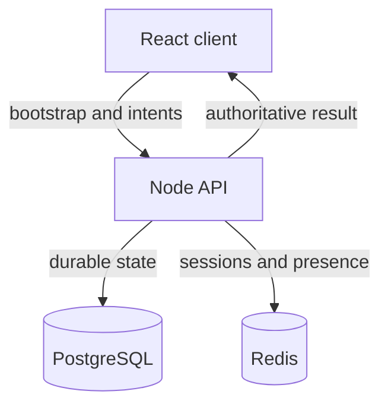

# MVP architecture

The backend is authoritative for persistent player and world state. React never writes cash, vitals, location or police heat directly. It submits an intent with an idempotency key and expected state version; PostgreSQL applies the result inside a transaction.

Redis is intentionally limited to ephemeral state: development sessions, presence, cooldowns and later short-lived locks. PostgreSQL owns durable truth.

The first vertical slice is a three-segment Las Palmas street network. React renders code-native 2.5D scenes and selectable objects, but the API decides whether travel, access, work, crime, NPC and salvage actions are valid. PostgreSQL persists the current segment, exploration, durable flags, player condition, cash and inventory rewards. Redis exposes only the remaining lifetime of short-lived action cooldowns.

## State boundaries

- Character recipe preserves the accepted HM08 creator output as JSON.
- HUD is a view over player state, never a second state store.
- Cash is stored as integer cents.
- Every player state mutation increments `version` for optimistic concurrency.
- Every action has a client-generated UUID and a unique durable log row, preventing duplicate rewards on retries.
- Street object selection is local presentation state; visible objects, action availability, cooldowns and consequences come from the API.
- Dumpster finds are inserted into the same physical inventory tables used by the Inventory screen.
