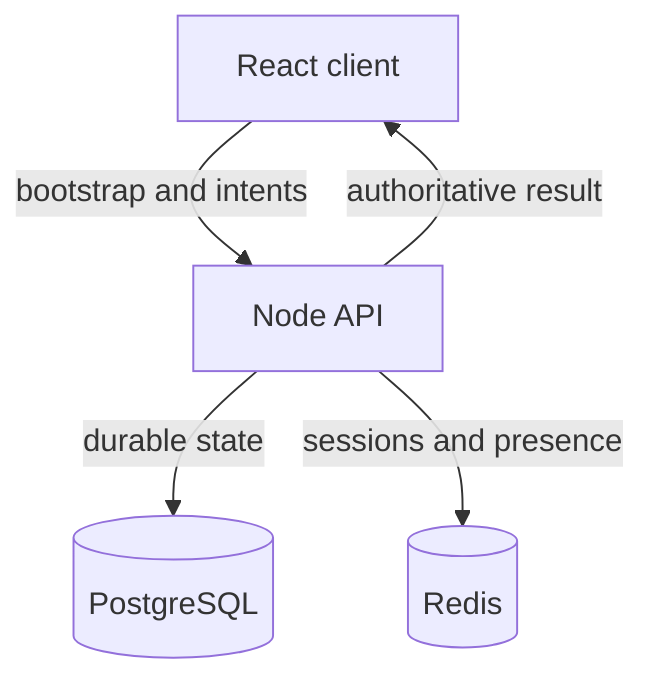

# MVP architecture

The backend is authoritative for persistent player and world state. React never writes cash, vitals, location or police heat directly. It submits an intent with an idempotency key and expected state version; PostgreSQL applies the result inside a transaction.

Redis is intentionally limited to ephemeral state: development sessions, presence, cooldowns and later short-lived locks. PostgreSQL owns durable truth.

The first vertical slice is one Las Palmas district. It proves the full loop: see world, choose an action, server resolves consequences, persistent state changes and the HUD gives feedback.

## State boundaries

- Character recipe preserves the accepted HM08 creator output as JSON.
- HUD is a view over player state, never a second state store.
- Cash is stored as integer cents.
- Every player state mutation increments `version` for optimistic concurrency.
- Every action has a client-generated UUID and a unique durable log row, preventing duplicate rewards on retries.
